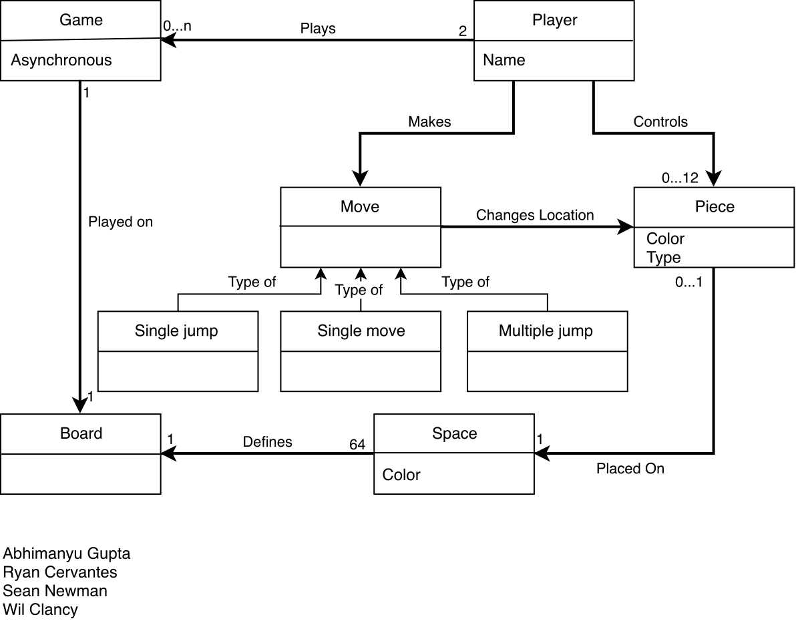
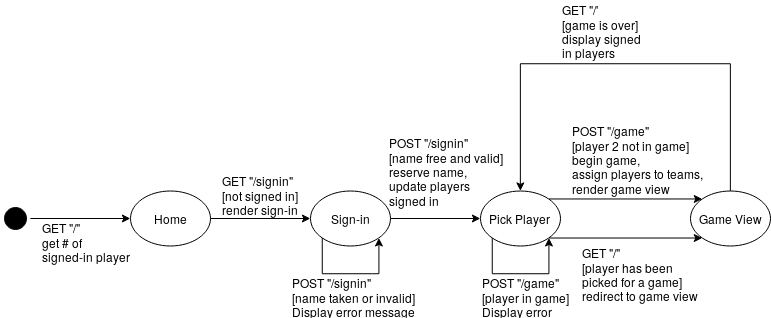

# PROJECT Design Documentation

## Team Information
* Team name: CyberCheckers
* Team members
  * Ryan Cervantes
  * Wil Clancy
  * Abhimanyu Gupta
  * Sean Newman

## Executive Summary

### Purpose

The goal of this project is to create an online checkers service, in
which multiple people can challenge and play one another in games of 
checkers.

### Glossary and Acronyms

 Term | Definition 
------|------------
Player | A signed-in user 
Game | A single game played between two players 
Board | The model-tier representation of the game board 
BoardView | The UI-tier representation of the game board 
Space | The model-tier representation of a space on the game board 
SpaceView | The UI-tier representation of a space on the game board 
Piece | The model-tier representation of a piece on a space on the game board
PieceView | The UI-tier representation of a piece on a space on the game board

## Requirements

### Definition of MVP
> The Minimum Viable Product must allow users to log into the
online service and challenge other players to checkers games that
follow the official checkers rules.

### MVP Features
> _The Minimum Viable Product includes the following:_

* **Log in and start a game:** users must be able to log into the
online service, and view the list of other players online. Upon
clicking a player's name, a game will be started between them.

* **Move and jump pieces:** upon entering a game, players must be
able to move their pieces (during their turn)
 according to official checkers rules, 
including jumping and removing pieces.

* **Finish a game and return to lobby:** the game ends when a 
player is out of turns, or all their pieces are removed. Upon the
completion of the game, the players are returned to the lobby
so that they can start a new game again.

### Roadmap of Enhancements
> _The product will feature these enhancements to the MVP:_

* **Multiple games:** players will be able to be engaged in different
games with different players at the same time.

* **Asynchronous play:** players will be able to take their turns
on their own time. The game state for each game is saved so that
players can always leave and come back to it when they are ready.

## Application Domain

> _The Domain Model_

When users log into the site, they are recognized as a **_player_**. Players can view other players that
are logged in, and select them to start a **_game_**.
 New games start on a fresh **_board_**, which consists of an 8x8 grid of **_spaces_**, 
 that can hold **_pieces_**. Each player starts with 12 pieces, and take turns moving them
 around the board, jumping each other until one player's pieces are gone, or there are no moves left. 
 When a player wins and the game ends, both players are returned to the lobby.

## Architecture and Design

### Summary

The following Tiers/Layers model shows a high-level view of the webapp's architecture.

As a web application, the user interacts with the system using a
browser.  The client-side of the UI is composed of HTML pages with
some minimal CSS for styling the page.  There is also some JavaScript
that has been provided to the team by the architect.

The server-side tiers include the UI Tier that is composed of UI Controllers and Views.
Controllers are built using the Spark framework and View are built using the FreeMarker framework.  The Application and Model tiers are built using plain-old Java objects (POJOs).

Details of the components within these tiers are supplied below.

### Overview of User Interface

This section describes the web interface flow; this is how the user views and interacts
with the WebCheckers application.

* Upon arriving at the site, the user is greeted with a **_home_** page that tells the user
how many users are currently logged into the service. 
* By clicking on a sign in link,
they are brought to the **_sign-in_** page, where they must enter a username that follows
a certain set of rules. 
* Upon entering a valid username, the user will be brought a new version
of the home page, that shows all of the players available for a game.
* Clicking on one of these players will redirect both users to the **_game_** page,
where the checkers game will be played.

### UI Tier

The UI tier works closely with the application to determine what information should be
shown to the user. The GetHomeRoute class has the responsibility of passing relevant
information to the _home.ftl_ file so that the home page can be rendered. When the user
first accesses the home page before signing in, the **_GetGameRoute_** communicates with the
PlayerLobby to determine if this user has been signed in. Because the user hasn't signed in,
the limited home page is rendered. Usernames of signed in players can't be seen; only the number
of online users is given.

Next, the user wants to sign in, so that they can play a game. They click the sign-in link on the
home page to cause the **_GetSignInRoute_** class to check if the player has been signed in already. Because
this user hasn't, they are taken to the sign-in page using the _signin.ftl_ file, where they can enter their desired username.

Upon submitting their username, the **_PostSignInRoute_** will conduct the checking of the username's validity.
Entering an invalid username will cause the page to reload for the user to try again. A valid one will
redirect the user back to the home page.

Except this time, the home page is different. The **_GetHomeRoute_** recognizes that the user is now signed in,
so the full home page is rendered. Instead of the number of users being displayed, there is a list of
all players currently online and not in a game.

Clicking on one of these users will begin a game with them, unless they happen to have
just been selected by someone else before you. This is where the **_GetGameRoute_** comes in. The
GetGameRoute will match the current user and the challenged user in a new game, where
the current user is the red player, and the selected player is the white player. The game page
is rendered using this information.

But, in order to render the game view, a visual representation of the board is needed. The board view
is made up of several sub classes: a **_PieceView_** represents an individual piece that can be owned by 
a **_SpaceView_**, that, when put together with others, makes up a **_RowView_**, the visual representation of a row of the board.
Several RowViews make up the entire **_BoardView_**. These things are created based on the current state of the
board, which, in this case, is a new, fresh board, with the current player's pieces
appearing at the bottom of the board.

Now that the BoardView is made, the game page can be rendered using the _game.ftl_ file 
and the game can begin. The
game page is reloaded consistently as the game progresses.

### Application Tier

The most important aspect of the application tier is the **_PlayerLobby_** class, which
keeps track of the players signed into the service. The PlayerLobby contains a HashMap
that matches player usernames to their _Player_ objects. When a user is signed in, they are added to 
the HashMap, and they are removed when they sign out.

After signing in, the user can challenge another user to a game. Upon challenging another user,
the PlayerLobby tells another class, the **_GameCenter_**, to start a new game. The GameCenter
is in charge of creating new games and keeping track of all current games. When the user challenges another
player, the GameCenter creates a game between these two players, and the game is added to
the GameCenter's list of current games. The two players are also added to a HashMap that connects
players to their current opponents.

### Model Tier

Prior to signing in, users have very little access to anything on the site. It isn't until after
signing in that an instance of **_Player_** is created for the user. Players are identified not only by
the unique username that the user submits when signing in, but also the user's session ID.

When players challenge one another, a new instance of **_Game_** is created. The game holds all of the data
needed for a game to happen between two players. The players on each team, the current turn, and, most
importantly, the _Board_.

The **_Board_** class is the class in charge of keeping track of the data regarding the game board state.
The board is made up of a 2D array of **_Space_** instances, which can each potentially hold a **_Piece_**,
if the space is colored black. 

Players take turns moving their pieces from space to space on the board to remove their opponents pieces,
and ultimately win the game.

### Design Improvements

In the future, the team can be more careful to adhere to design principles such
as Law of Demeter and Low Coupling. Up until recently, the _Board_ class had the 
responsibility of building the _BoardView_ in the UI tier, which was a significant
violation of design principles, as the Model and UI have no reason to directly interact.
However, this violation has since been corrected. Hopefully, we will be more aware in 
the future to avoid violations such as that, now that we have identified one and gone
through the process of correcting it.

## Testing
> _This section will provide information about the testing performed
> and the results of the testing._

### Acceptance Testing

There have currently been two user stories and two spike stories completed:
1. Player Sign-In
2. Start a Game
3. Spike: Domain-Driven Design
4. Spike: Web Architecture

These stories have all passed their acceptance criteria. No other stories have 
reached the end of development to be tested as of yet.

### Unit Testing and Code Coverage

For unit testing, responsibility was split up so that that each team member completed
unit tests for two classes. Because these were our first classes to be tested, we tried to
focus on simpler classes to test first, to familiarize ourselves with how testing works and
should be done, so that the more complicated classes would potentially be less daunting. For
that reason, our UI "route" classes have not yet been tested, since they have more than one
component to be tested. Our coverage of the classes we did test, however, can be improved. In
the UI tier, results of testing are good, but could use more branch coverage. Our testing
in the model and application seem more thorough, with the outlier being the PlayerLobby class and 
Player classes, which are missing some coverage and need to be revisited.
